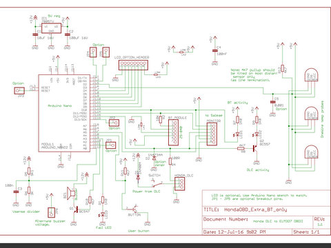

ArduinoHondaOBD_Extra (based on the original project by kerpz)
===========
An arduino project that reads old Honda OBD diagnostic protocol and translates it to ELM327 protocol so any Android OBDII scanner apps can connect with the older Honda OBDI ECU and read the ECU info like it was an OBDII ECU (in countries where Honda did NOT have to use OBDII).
This project connects the older generation Honda ECU's to an Android or Windows app via bluetooth serial. All the regualr available EFI sensors are translated. Typically you would use this with apps like 'Torque' (which normally use an ELM327 or compatible bluetooth dongle). 

This fork now has two versions building on kerps original project and his code.
 
Compact version - A very low component count version that uses only two resistors and two diodes with the Arduino Nano and a HC-05 bluetooth module. A buzzer is optional.

Expanded version - This is the version that has been here a couple of years. It adds extra sensors to the car and engine that are connected to the Arduino Nano. The sensors are three Dallas DS18B20 sensors and one voltage output oil pressure sensor. The dallas temperature sensors are intended to be glued down with a high temperature heatsinking adhesive to the engine sump case, gearbox case and differential case (using adhesive bought from Ebay for mounting high power LED's to heatsinks etc).

Supports
--------
* Honda ECU's before 2002 in countries other than the USA (who had OBDII after 1996).
* This fork will be tested on an OzDM 1999 Honda S2000 used for track days. It should work on other 90's Hondas but will depend on what * ECU it's got. Try the compact version if there are doubts...

Files
-----
* hobd_elm_with_DS18B20 - My current main version (with no LCD) and three extra temperature sensors, oil pressure sensor, buzzer and RGB * warning LED.
* honda_dlc_to_obdii_bluetooth - Compact version with minimul component count. 
* 

Basic wiring for ArduinoHondaOBD_Extra
--------------------
    Honda 3 Pin DLC           Arduino Nano
    Gnd --------------------- Gnd
    +12 --------------------- Vin
    K-line ------------------ Pin12

    HC-05 Bluetooth           Arduino Nano               
    Rx ---------------------- Pin11
    Tx ---------------------- Pin10

    LCD 16x2                  Arduino Nano               
    RS ---------------------- Pin9
    Enable ------------------ Pin8
    D4 ---------------------- Pin7
    D5 ---------------------- Pin6
    D6 ---------------------- Pin5
    D7 ---------------------- Pin4

(Taken from Kerpz Git repo)

Wiring for hobd_elm_with_DS18B20
--------------------
    *See the schematic PDF in the schematic folder for my full circuit.
    My circuit follows Kerpz original as much as possible for compatibility.
    I have 'industrialised' the circuit a little to make it robust in an automotive environment.
    Kerpz's wiring diagram can be used with my code additions by adding the DS18B20's. 
    The extra complexity of my cicuits includes provision for the PCB to be used with an LCD,
    and access to key pins for monitoring with a CRO or Logic analyser. 
    Debugging serial terminal work in the Arduino IDE from the USB port.

TODO
-----
* Upload Eagle files
* Code tidy-up ongoing ;)
* 
